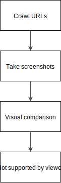

# visual-diff-tool

This is repo is a collection of thoughts and technical design documents for a tool which would allow website owners to see visual diffs of their site changes before a release.

**Goals:**

* Focus on websites and web applications which have a url based routing
* Adds useful information to release management
* Visual diffs are always reviewed by a person, not an automatic fail/pass test
* Usage should be easy in default case, but also configurable for more advanced setups. For example, by default user just points the tool to the index page and the tool crawls the public pages.
* Can be run against a local website, or a publicly hosted one
* Meant to be run in a CI and integrates to Github PR flow
* Users provide their own S3 for storage
* User interface to accept the latest
* Support branching and separate production / qa environments for sites. Preferably the user could control what the environment name is: when running in CI, it would probably be branch name, but it could be just even "production" or "test".

## Challenges

* Dynamic content
  * Videos
  * Gifs
  * Animations
  * A/B testing
  * Latest news
* Authentication
* Comparing partial sections / components of a page
* Would it need support for interacting with the site? For example click a button or input text. This brings a ton of new complexity and needs deeper integration to frameworks.

## Existing solutions

https://visualregressiontesting.com/tools.html

* Percy.io
* https://github.com/facebookarchive/huxley and https://github.com/facebookarchive/huxley/issues/78

## Diagrams

**Usage flow**

**Branching**

![branches.svg]
